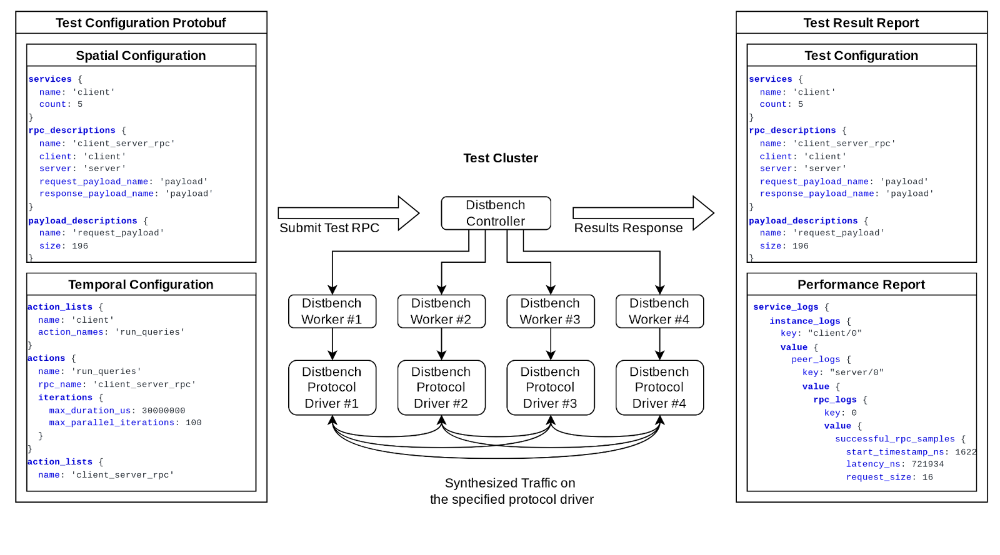

As depicted in Figure 1, Distbench functions as a distributed system that synthesizes the traffic patterns of other distributed systems. It consists of a single controller node that manages multiple worker nodes, with each worker node typically being placed on a separate physical or virtual machine. Performance experiments are started by delivering a traffic configuration message to the controller node via RPC. The controller node coordinates the activities of the worker nodes, assigning roles, introducing workers to their peers, and collecting performance data at the end of the experiment.

The controller node responds to the traffic configuration RPC with a message containing the performance results that were collected and the configuration that was tested. Upon the completion of one experiment another may be started by subsequent RPC at any time, without needing to restart or reconfigure the tasks on the individual nodes or interact with any sort of cluster scheduling system. This workflow ensures that running a collection of performance experiments with Distbench is fast and easy, regardless of the underlying cluster management system.

|  |
| :--: |
| *Figure 1* |

The traffic configuration RPCs sent to the Distbench controller can originate from an automated system or an interactive user. A common example of automated usage would be detecting and tracking performance regressions. Interactive usage would typically occur when designing a new traffic pattern or tuning a networking stack. Interactive users can cancel and replace the running traffic pattern at any time, with the new traffic pattern taking effect within seconds, enabling very fast iteration through a parameter space.

In order to further accelerate and simplify iterative performance tuning, Distbench is compiled as an all-in-one "busybox" style binary. This means that if a developer is troubleshooting a performance issue and needs to make code changes to either Distbench or the RPC layers underlying it, then they only need to deploy a single executable file to the test cluster before they can begin running multiple benchmark scenarios against their latest code.

In contrast to Distbench, a more traditional benchmark architecture requires deploying multiple binaries and interacting with the cluster's job scheduling system for each test, possibly requiring a new set of machines be reserved for each test, which adds latency and variability to the results.

A common problematic scenario with some other benchmarks is the need to edit a configuration file to modify test parameters but not having those parameters recorded in the test results, leading to human error when test results are interpreted incorrectly as having been run with a different set of parameters. Distbench avoids this problem by always including the full test configuration metadata in the results.

Finally, traditional benchmarks may interact poorly with multiple users trying to share limited cluster resources as distinct test jobs may be antagonistic to each other when run in parallel. Due to its RPC-based architecture, Distbench can ensure that each test is run in isolation without needing to fully lock other users out of the test cluster.
