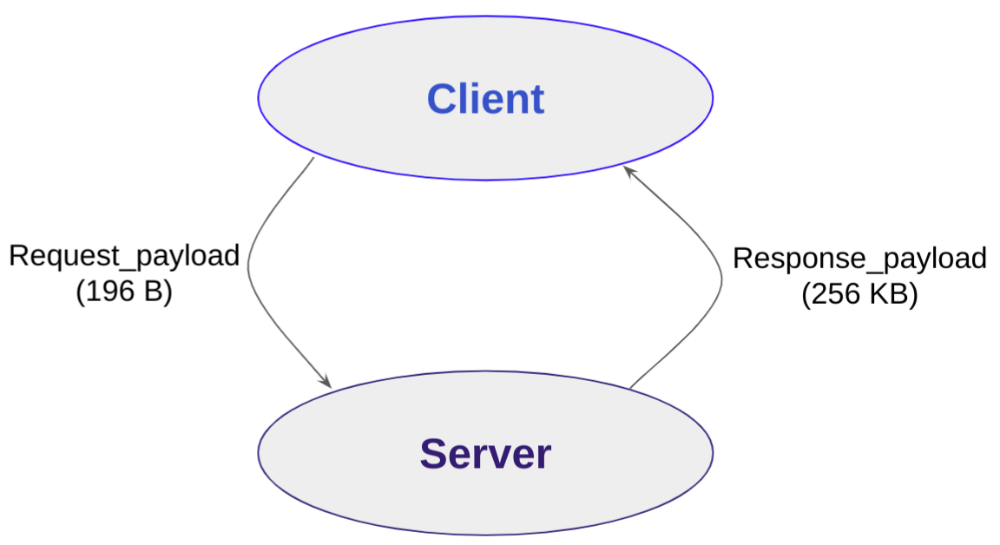
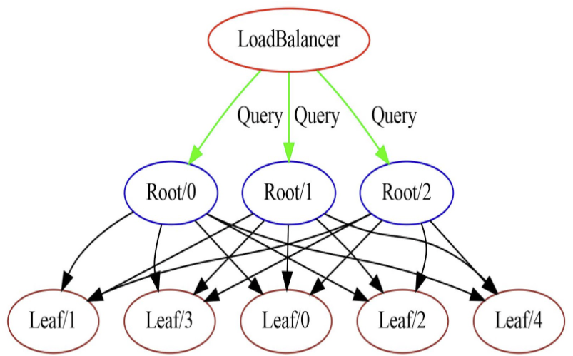
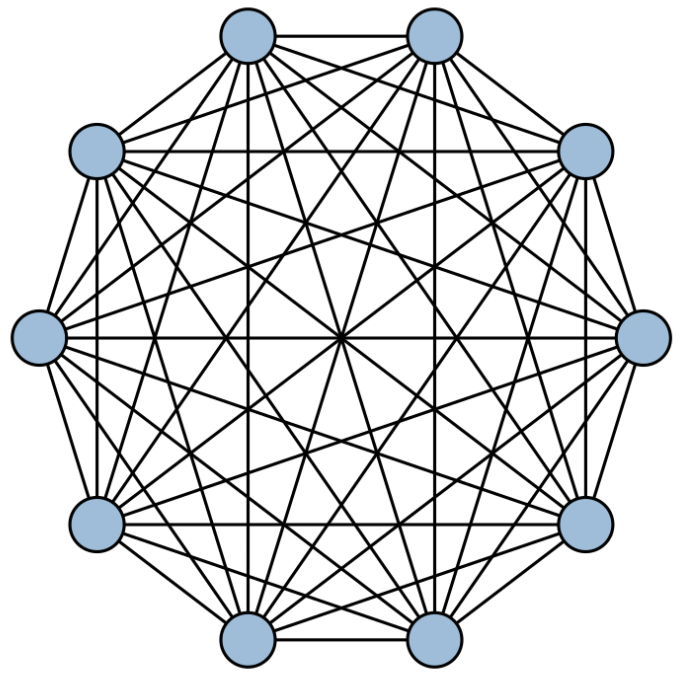
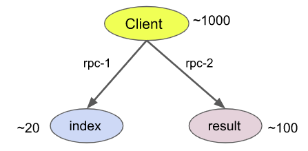
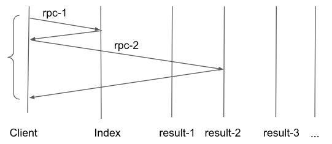

# Distbench Test Workloads

## Simple client server

This is the simplest workload for Distbench. A client performs a request to a
server which returns a response.



### Implementation

First two services are implemented and named client and server.
```yaml
tests {
  services {
    name: "client"
    count: ${CLIENT_COUNT}
  }
  services {
    name: "server"
    count: ${SERVER_COUNT}
  }
```

Then an action list is defined for the client, the name matches the service we
defined earlier. It will define what the actions for client are, when the test
start. In that case it will run the action `run_queries`.
```yaml
  action_lists {
    name: "client"
    action_names: "run_queries"
  }
```

The action is then defined as follows, in this case `run_queries` will perform
the `client_server_rpc` rpc 100 times:
```yaml
  actions {
    name: "run_queries"
    rpc_name: "client_server_rpc"
    iterations {
      max_iteration_count: 100
    }
  }
```

The `client_server_rpc` is defined as follows, the RPC is done from the client
to the server. The request is defined has having 196B of payload and the
response will cary 256kB.
```yaml
  rpc_descriptions {
    name: "client_server_rpc"
    client: "client"
    server: "server"
    request_payload_name: "request_payload"
    response_payload_name: "response_payload"
  }
  payload_descriptions {
    name: "request_payload"
    size: 196
  }
  payload_descriptions {
    name: "response_payload"
    size: 262144
  }
```

Finally, the action performed when the `client_server_rpc` request is received
by the server is defined. In this case, no extra processing is performed, so
there is no action to perform. The response to the RPC is implied.
```yaml
  action_lists {
    name: "client_server_rpc"
    # No action on the server; just send the response
  }
}
```

### Running the test

To run the test, a `test_sequencer` with two node managers are required.

```bash
#(On 1 server node)
bazel run :distbench -c opt -- test_sequencer --port=10000 &
bazel run :distbench -c opt -- node_manager --test_sequencer=localhost:10000 --port=9999 &

#(On another server node)
bazel run :distbench -c opt -- node_manager --test_sequencer=localhost:10000 --port=9999 &

#(On the client), to inspect the configuration
../test_builder/test_builder client_server:client_count=1:server_count=1:parallel_queries=100
#(On the client), to run the test configuration
../test_builder/test_builder client_server:client_count=1:server_count=1:parallel_queries=100 -s first_server_hostname:10000 -o result_folder
```

Alternatively to simply run on a single development system (localhost):
```bash
~/distbench$ ./start_distbench_localhost.sh -n 2
# CTRL-Z
~/distbench$ bg
~/distbench$ mkdir result_folder
~/distbench$ ./test_builder/test_builder client_server:client_count=1:server_count=1:parallel_queries=100 -s localhost:10000 -o result_folder
```
The test should take a couple of seconds to run and you will obtain the
following summary output:

```
Individual test config saved in client_server_1x1x100-grpc.config
Trying to produce x3/client_server_1x1x100-grpc.pb.
Starting at Tue Feb  8 06:42:33 PM PST 2022.
Test summary:
RPC latency summary:
  client_server_rpc: N: 141510 min: 5402961ns median: 19215859ns 90%: 30860901ns 99%: 39562988ns 99.9%: 53808005ns max: 78776286ns
Communication summary:
  client/0 -> server/0: RPCs: 141510 (4.72 kQPS) Request: 0.9 MiB/s Response: 1178.8 MiB/s
Instance summary:
  client/0: Tx: 0.9 MiB/s, Rx:1178.8 MiB/s
  server/0: Tx: 1178.8 MiB/s, Rx:0.9 MiB/s
Global summary:
  Total time: 30.012s
  Total Tx: 35403 MiB (1179.6 MiB/s), Total Nb RPCs: 141510 (4.72 kQPS)
```

In the `result_folder/`, you can find the tesst configuration as well as the
a binary and compressed protobuf of the results. In clear text, the protobuf
would something like:
```yaml
test_results {
  traffic_config {
    attributes: { key: 'client_count' value: '1' }
    attributes: { key: 'config_label' value: 'client_server:client_count=1:server_count=1:parallel_queries=100' }
    attributes: { key: 'parallel_queries' value: '100' }
    attributes: { key: 'protocol_alias' value: 'grpc' }
    attributes: { key: 'protocol_driver' value: 'grpc' }
    attributes: { key: 'server_count' value: '1' }
    attributes: { key: 'test_duration' value: '30' }
    attributes: { key: 'test_name' value: 'client_server_1x1x100-grpc' }
    attributes: { key: 'test_timeout' value: '90' }
    attributes: { key: 'traffic_alias' value: 'client_server_1x1x100' }
    attributes: { key: 'traffic_pattern' value: 'client_server' }
    default_protocol: 'grpc'
    protocol_driver_options {
      name: 'common_options'
    }
    name: 'client_server_1x1x100-grpc'
    services {
      name: 'client'
      count: 1
      protocol_driver_options_name: 'common_options'
    }
    services {
      name: 'server'
      count: 1
      protocol_driver_options_name: 'common_options'
    }
    rpc_descriptions {
      name: 'client_server_rpc'
      client: 'client'
      server: 'server'
      request_payload_name: 'request_payload'
      response_payload_name: 'response_payload'
    }
    payload_descriptions {
      name: 'request_payload'
      size: 196
    }
    payload_descriptions {
      name: 'response_payload'
      size: 262144
    }
    action_lists {
      name: 'client'
      action_names: 'run_queries'
    }
    actions {
      name: 'run_queries'
      rpc_name: 'client_server_rpc'
      iterations {
        max_duration_us: 30000000
        max_parallel_iterations: 100
      }
    }
    action_lists {
      name: 'client_server_rpc'
    }
  }
  placement {
    service_endpoints {
      key: "client/0"
      value {
        endpoint_address: "[0000::0001:0002:0003:0004%eth0]:1118"
        hostname: "host1"
      }
    }
    service_endpoints {
      key: "server/0"
      value {
        endpoint_address: "[0000::0001:0002:0003:0004%eth0]:1094"
        hostname: "host1"
      }
    }
  }
  service_logs {
    instance_logs {
      key: "client/0"
      value {
        peer_logs {
          key: "server/0"
          value {
            rpc_logs {
              key: 0
              value {
                successful_rpc_samples {
                  request_size: 16
                  response_size: 0
                  start_timestamp_ns: 1622744047420305230
                  latency_ns: 721934
                }
                # Many, many more RPC traces.
              }
            }
          }
        }
      }
    }
  }
  log_summary: "
RPC latency summary:
  client_server_rpc: N: 141510 min: 5402961ns median: 19215859ns 90%: 30860901ns 99%: 39562988ns 99.9%: 53808005ns max: 78776286ns
Communication summary:
  client/0 -> server/0: RPCs: 141510 (4.72 kQPS) Request: 0.9 MiB/s Response: 1178.8 MiB/s
Instance summary:
  client/0: Tx: 0.9 MiB/s, Rx:1178.8 MiB/s
  server/0: Tx: 1178.8 MiB/s, Rx:0.9 MiB/s
Global summary:
  Total time: 30.012s
  Total Tx: 35403 MiB (1179.6 MiB/s), Total Nb RPCs: 141510 (4.72 kQPS)
"
}
```

### Interpreting the results

The results contain 4 sections:
1. `traffic_config`: the configuration of the traffic pattern specified (see the
   Implementation section).
2. `placement`: the description of the service placement on the different
   Distbench `node_manager`.
3. `service_logs`: a long of the different RPC performed during the test, with
   their sizes, timestamps, etc. As we specified 100 iterations, we have 100
   `successful_rpc_samples` in this section.
4. `log_summary`: A concise summary of the RPC performance

In this case , the `log_summary` indicates that 141510 rpcs were performed (N)
with a median latency of 19ms.

## Multi-level RPC pattern

For this pattern,
1. a load balancer distributes queries to a serie of root servers.
2. the root servers will then gather partial results from all the leaf nodes and
   waits for those results.
3. once all the responses are received, the original RPC response is sent to the
   load balancer.



### Implementation

See the `multi_level_rpc_traffic_pattern_setup` function in
[test\_builder source](../test_builder/test_builder) for the details.

```yaml
  rpc_descriptions {
    name: 'root_query'
    client: 'load_balancer'
    server: 'root'
    fanout_filter: 'round_robin'
    request_payload_name: 'root_request_payload'
    response_payload_name: 'root_response_payload'
  }
```
The `load_balancer` will distribute the requests in a `round_robin` fashion.

When the `root_query` is received by the root server, it then distribute the
queries across all the leaf servers (`fanout_filter: all`):

```yaml
  action_lists {
    name: "root_query"
    action_names: "root/root_query_fanout"
    max_rpc_samples: 256
  }
  actions {
    name: "root/root_query_fanout"
    rpc_name: "leaf_query"
  }
  rpc_descriptions {
    name: 'leaf_query'
    client: 'root'
    server: 'leaf'
    fanout_filter: 'all'
    request_payload_name: 'leaf_request_payload'
    response_payload_name: 'leaf_response_payload'
  }
```

### Running

```bash
~/distbench$ ./start_distbench_localhost.sh -n 6
# CTRL-Z (or switch to a different terminal)
~/distbench$ ./test_builder/test_builder multi_level_rpc:leaf_count=3:root_count=2:qps=500 -s localhost:10000 -o result_folder/
```

## Clique RPC pattern

The Clique pattern involves a number of nodes needing to exchange some state at
every step.

- Periodically (every few milliseconds), an all-to-all exchange of messages is
  performed.
- This is done by pairwise exchanges (i.e. all the nodes send a small message to
  all the other nodes). All those exchanges need to complete as soon as
  possible.

As the number of nodes grow, this test becomes a challange for the RPC layer.

We target around 100 nodes for this benchmark.



### Implementation

```yaml
  actions {
    name: 'clique_queries'
    iterations {
      max_duration_us: 10000000
      open_loop_interval_ns: 16000000
      open_loop_interval_distribution: 'sync_burst'
    }
    rpc_name: 'clique_query'
  }
  payload_descriptions {
    name: 'request_payload'
    size: 1024
  }
  payload_descriptions {
    name: 'response_payload'
    size: 1024
  }
  rpc_descriptions {
    name: 'clique_query'
    client: 'clique'
    server: 'clique'
    fanout_filter: 'all'
    request_payload_name: 'request_payload'
    response_payload_name: 'response_payload'
  }
```

The `clique_query` is run every 16 ms (`open_loop_interval_ns`) in a synchronous
fashion (`sync_burst`). The test will run for 10s (`max_duration_us`).

Each clique service will send the `clique_query` (`fanout_filter: "all"`).

The burst across all nodes are synchronized (`sync\_burst`).

### Running

```bash
~/distbench$ ./start_distbench_localhost.sh -n 10
# CTRL-Z
~/distbench$ bg
~/distbench/workloads$ ./test_builder/test_builder clique -s localhost:10000 -o result_folder/

```

Expected output:
```
Individual test config saved in clique_sync_burst_10x16000-grpc.config
Trying to produce result_folder//clique_sync_burst_10x16000-grpc.pb.
Starting at Tue Feb  8 07:22:16 PM PST 2022.
Test summary:
RPC latency summary:
  clique_query: N: 168750 min: 107669ns median: 1123240ns 90%: 3337945ns 99%: 369610494ns 99.9%: 747276205ns max: 848928586ns
Communication summary:
  clique/0 -> clique/1: RPCs: 1875 (0.06 kQPS) Request: 0.1 MiB/s Response: 0.1 MiB/s
  clique/0 -> clique/2: RPCs: 1875 (0.06 kQPS) Request: 0.1 MiB/s Response: 0.1 MiB/s
  clique/0 -> clique/3: RPCs: 1875 (0.06 kQPS) Request: 0.1 MiB/s Response: 0.1 MiB/s
  clique/0 -> clique/4: RPCs: 1875 (0.06 kQPS) Request: 0.1 MiB/s Response: 0.1 MiB/s
  ...
  clique/9 -> clique/5: RPCs: 1875 (0.06 kQPS) Request: 0.1 MiB/s Response: 0.1 MiB/s
  clique/9 -> clique/6: RPCs: 1875 (0.06 kQPS) Request: 0.1 MiB/s Response: 0.1 MiB/s
  clique/9 -> clique/7: RPCs: 1875 (0.06 kQPS) Request: 0.1 MiB/s Response: 0.1 MiB/s
  clique/9 -> clique/8: RPCs: 1875 (0.06 kQPS) Request: 0.1 MiB/s Response: 0.1 MiB/s
Instance summary:
  clique/0: Tx: 1.1 MiB/s, Rx:1.1 MiB/s
  clique/1: Tx: 1.1 MiB/s, Rx:1.1 MiB/s
  clique/2: Tx: 1.1 MiB/s, Rx:1.1 MiB/s
  clique/3: Tx: 1.1 MiB/s, Rx:1.1 MiB/s
  clique/4: Tx: 1.1 MiB/s, Rx:1.1 MiB/s
  clique/5: Tx: 1.1 MiB/s, Rx:1.1 MiB/s
  clique/6: Tx: 1.1 MiB/s, Rx:1.1 MiB/s
  clique/7: Tx: 1.1 MiB/s, Rx:1.1 MiB/s
  clique/8: Tx: 1.1 MiB/s, Rx:1.1 MiB/s
  clique/9: Tx: 1.1 MiB/s, Rx:1.1 MiB/s
Global summary:
  Total time: 29.985s
  Total Tx: 329 MiB (11.0 MiB/s), Total Nb RPCs: 168750 (5.63 kQPS)

```

We have 168750 RPCs (The test run for 1875 cycles -30s/16ms- and there is 10\*9
RPCs per cycle)

## Tripartite RPC pattern

This pattern involves three types of nodes:
- client nodes
- index nodes
- result nodes



The client nodes retrieves results by performing sequential pair of RPCs:
- Querying the location of the result to an index host
- Retrieving the contents of that record from a result host

The dependencies between each pair of RPCs are properly handled.



### Implementation

The dependency between the index and the result query is handled by a
dependencies as shown below:

```yaml
  action_lists {
    name: "client_do_one_query"
    action_names: "client_queryindex"
    action_names: "client_queryresult"
  }
  actions {
    name: "client_queryindex"
    rpc_name: "client_index_rpc"
  }
  actions {
    name: "client_queryresult"
    rpc_name: "client_result_rpc"
    dependencies: "client_queryindex"
  }
```
## Test Stochastic Example

This example demonstrates the stochastic fanout option. In this pattern, the
client will perform a random number of requests to the server. It is defined by
the `fanout_filter`, in this case in 70% of the cases the client will perform
one request, and in 30% of the cases it will do the request to 4 distinct
servers.

```yaml
fanout_filter: "stochastic{0.7:1,0.3:4}
```

The number of RPCs will slightly vary from run to run due to the random
parameter.
